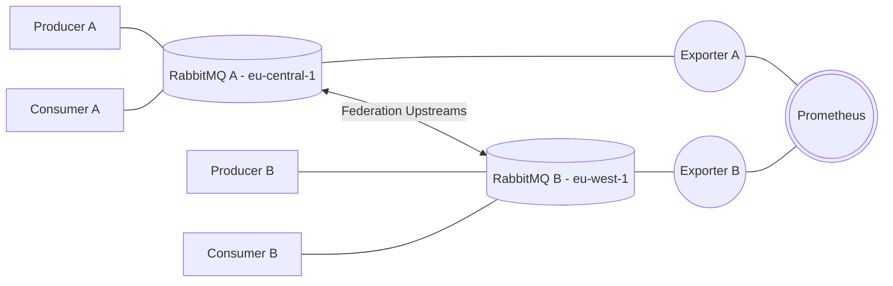

# Exchange Federation

### Architectural diagram


### Step by step

1. Launch RabbitMQ
```sh
cd $(git rev-parse --show-toplevel)/exchange-federation/
docker-compose up -d rabbitmq-eu-central-1 rabbitmq-eu-west-1 rabbitmq-eu-central-1-exporter rabbitmq-eu-west-1-exporter prometheus
```

2. Configure RabbitMQ
    1. RabbitMQ A (eu-central-1)
    ```sh
    cd $(git rev-parse --show-toplevel)/exchange-federation/terraform/eu-central-1/
    terraform init
    terraform apply
    ```
    2. RabbitMQ A (eu-west-1)
    ```sh
    cd $(git rev-parse --show-toplevel)/exchange-federation/terraform/eu-west-1/
    terraform init
    terraform apply
    ```

3. Launch producers and consumers
```sh
cd $(git rev-parse --show-toplevel)/exchange-federation/
docker-compose up -d producer-eu-central-1 producer-eu-west-1 consumer-eu-central-1 consumer-eu-west-1
```

### References
* [RabbitMQ - Federated Exchanges](https://www.rabbitmq.com/federated-exchanges.html)

# Requirements
* Terraform
* Docker
* Docker Compose
