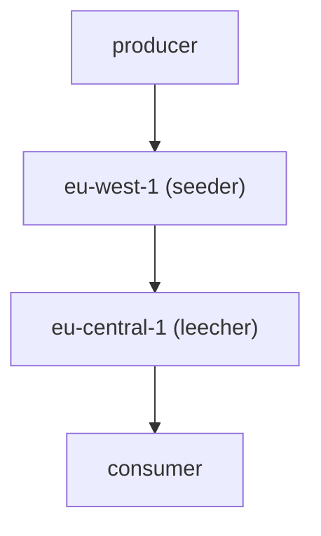

# Queue Federation

### Architectural diagram


### Step by step

1. Launch RabbitMQ
```sh
cd $(git rev-parse --show-toplevel)/queue-federation/
docker-compose up -d rabbitmq-eu-west-1 rabbitmq-eu-central-1
```

2. Configure RabbitMQ
    1. Seeder
    ```sh
    cd $(git rev-parse --show-toplevel)/queue-federation/terraform/eu-central-1/
    terraform init
    terraform apply
    ```
    2. Leecher
    ```sh
    cd $(git rev-parse --show-toplevel)/queue-federation/terraform/eu-west-1/
    terraform init
    terraform apply
    ```

3. Launch producer and consumer
```sh
cd $(git rev-parse --show-toplevel)/queue-federation/
docker-compose up -d producer consumer
```

### References
* [RabbitMQ - Federated Queues](https://www.rabbitmq.com/federated-queues.html)

# Requirements
* Terraform
* Docker
* Docker Compose
